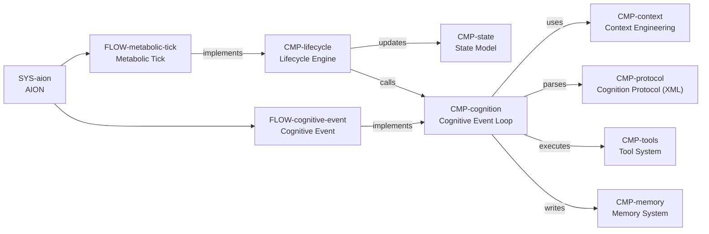
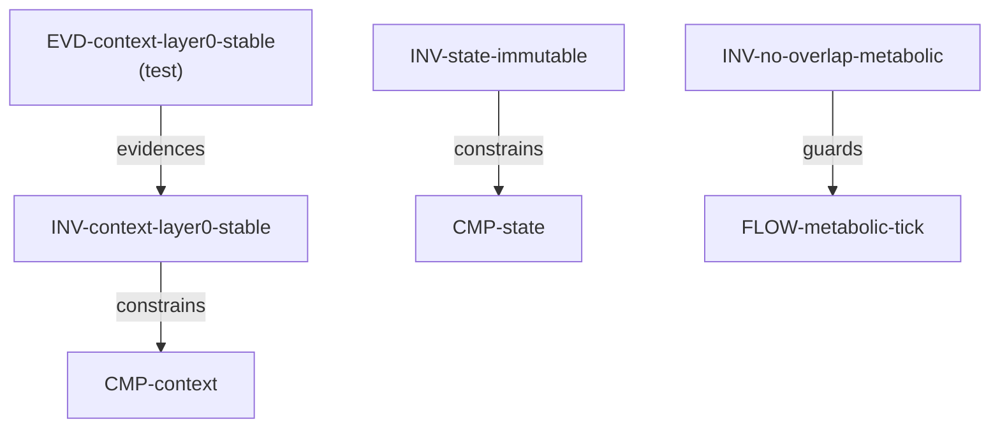

# Logic Schema (Meta-Language) v0.2

This file defines a **project-agnostic meta-language** for representing a codebase as a **logic-first mental model**.

It is designed to be:
- Human-readable (including non-specialists and cross-language readers)
- Agent-operable (gives an AI concrete pointers into code without “reading everything”)

The same document format can be:
- A shared “logic contract” between humans and coding agents
- A map for targeted code exploration (by file/symbol)
- A stable artifact that can be incrementally updated as the code evolves

## 0. Quickstart (read first)

If you are an agent, treat this document as an instruction set (a prompt), not only as reference text.

- For agents: jump to §6, decide which scenario you are in, and follow the playbook.
- For humans: jump to the instance section and read Mermaid views first, then `system` → `flows` → `components` → `relations`.

---

## 1. Goals

- **Logic over implementation**
  - Describe *what the system is* and *how it behaves*, not how each line is written.
- **Language/framework agnostic**
  - Make TS frontend and Python backend explorable under the same concepts.
- **Bidirectional bridge**
  - Humans read narrative + diagrams.
  - Agents read structured blocks + anchors.
- **Traceability**
  - Every important logical claim can point to:
    - a code location
    - a config location
    - a test (evidence)
- **Scalable cognition**
  - Supports very large repos by allowing “open a few referenced files first” rather than full scanning/RAG.

## 2. Non-goals

- Replacing programming languages.
- Capturing every file/class/function.
- Acting as API documentation for end users.

---

## 3. Core concepts (project-agnostic vocabulary)

- **System**
  - A runnable whole: entrypoints, runtime model, and boundaries.
- **Component**
  - A cohesive responsibility unit.
  - It may be a module/package/service/class/subsystem.
- **Flow**
  - A time-ordered behavior (startup, request handling, background job, event loop).
- **State**
  - A persistent or transient data model that shapes behavior.
- **Protocol**
  - A structured interface: HTTP, CLI, message bus, XML/JSON schema, prompt formats.
- **Capability**
  - An action surface that can change system state or observe the world.
- **Invariant**
  - A rule that must always hold (serial execution, immutability, idempotency, etc.).
- **Evidence**
  - Proof of an invariant/contract: tests, runtime assertions, monitoring, logs.

---

## 4. Document format (Markdown + structured blocks)

This document uses:
- Markdown for human narrative
- Structured blocks for agents

### 4.1 Structured blocks

- Use **YAML** fenced blocks for machine-readable sections.
- Keep IDs stable so agents can update incrementally.

Example:

```yaml
component:
  id: CMP-example
  title: Example Component
  purpose: What it is for
  anchors:
    - kind: code
      target: path/to/file.py#Class.method
      why: Why this anchor matters
```

### 4.2 Relations (edges) (v0.2)

To reduce overly linear narration, this schema supports an explicit **graph**.

- Nodes are defined by stable `id`s in sections like `components`, `flows`, `invariants`, `evidences`.
- `relations` is a list of directed edges connecting those nodes.
- Edges carry `refs` so an agent can jump into code/tests/config.

Schema:

```yaml
relation:
  id: REL-example
  from: CMP-a
  to: CMP-b
  kind: uses|calls|implements|updates|reads|writes|parses|executes|guards|evidences
  note: "human explanation"
  refs:
    - kind: code|file|config|test|command
      target: "..."
      why: "why this ref supports the edge"
```

Guidelines:

- Keep `kind` small and consistent; prefer a few high-signal edges.
- If a relation is only true under a specific behavior, reference the relevant `FLOW-*` in `note`.

### 4.3 Mermaid views (optional, human-first)

- Mermaid blocks should use the same node IDs as YAML `id`s (e.g. `CMP-lifecycle`).
- If a renderer does not accept `-` in node IDs, keep the YAML ID in the node label (so humans/agents can map it by `grep`).

---

## 5. Anchor syntax (how logic points to code)

### 5.1 Anchor kinds

- `code`: points to a file + a symbol path
- `file`: points to a file (no symbol)
- `config`: points to a configuration key
- `test`: points to a test that evidences behavior
- `command`: points to a runnable command/entrypoint

### 5.2 Anchor target conventions

**Code anchor**:

- `relative/path.ext#SymbolPath`
- `SymbolPath` uses `.` to represent nesting.

Examples:
- `aion/core/lifecycle.py#LifecycleEngine.metabolic_tick`
- `aion/core/dynamics.py#calculate_cognition_probability`
- `src/app.ts#AppShell.render` (TS example)

**Config anchor**:

- `relative/path.yaml#yaml:path.to.key`

Example:
- `config.yaml#yaml:aion.rhythm.metabolic_tick_interval_seconds`

**Test anchor**:

- `relative/path.py#TestClass.test_name`

Example:
- `tests/test_context_stability.py#TestContextLayerStability.test_layer0_never_changes`

### 5.3 Reference object schema

```yaml
ref:
  kind: code|file|config|test|command
  target: "..."
  why: "human explanation"
```

---

## 6. Agent workflow (how an AI uses this file)

This file is meant to be **agent-operable**. In other words: it is written so an agent can follow it as a prompt.

Recommended repo layout:

- `docs/LOGIC_SCHEMA.md`: schema + methodology (this file)
- `./LOGIC_MAP.md`: project-specific instance (small, stable, frequently updated)

This repository currently contains an instance section inside this file (AION). In repos that do not, `LOGIC_MAP.md` is the canonical place to keep the instance.

### 6.1 Three scenarios (what to do first)

#### Scenario A: repo root has no `LOGIC_MAP.md` (bootstrap)

Goal: produce a minimal, high-signal map that enables the next agent (or human) to reach relevant code in a few hops.

1. Check whether `./LOGIC_MAP.md` exists.
2. If missing, create it.
3. If the repo already has an instance section in `docs/LOGIC_SCHEMA.md` (like AION below), bootstrap by copying the project YAML block into `LOGIC_MAP.md` and trimming it.
4. Keep the first version intentionally small:
   - 1 system
   - 5-12 components
   - 2-5 flows
   - 5-20 relations
   - 3-10 invariants (optional at bootstrap)
   - 1-5 evidences (optional at bootstrap)
5. Ensure the generated `LOGIC_MAP.md` contains a **Maintenance** section (so agents know how to update it).

Minimal `LOGIC_MAP.md` template:

````markdown
# LOGIC_MAP (Project Logic Map)

This file is the project-specific instance of `docs/LOGIC_SCHEMA.md`.
It is both:

- a prompt for agents (task → nodes → anchors → code)
- a logic-first README for humans (Mermaid + graph + invariants)

## How to use (agents)

1. Convert the user request into one or more candidate nodes:
   - `FLOW-*` if it is behavior/time-ordered
   - `CMP-*` if it is a module/subsystem
   - `INV-*` if it is a rule/constraint
2. Traverse `relations` to find adjacent nodes.
3. Follow `anchors` / `refs` into code/tests/config.
4. If the map is insufficient, improve the map (add anchors/edges) before broad scanning.

## How to read (humans)

1. Mermaid (if present)
2. `system` (what it is)
3. `flows` (how it behaves)
4. `components` (what owns responsibilities)
5. `relations` (how the pieces connect)

```yaml
system:
  id: SYS-...
  title: ...
  purpose: ...
  entrypoints: []
  key_configs: []

components: []
flows: []
invariants: []
evidences: []
relations: []
```

## Maintenance

- Keep `id`s stable.
- Prefer `file#SymbolPath` anchors (line numbers are volatile).
- When behavior changes, update the nearest `FLOW-*` steps and the affected `relations`.
- When adding a new invariant, add at least one evidence ref when possible (test/assert/log).
````

#### Scenario B: repo root already has `LOGIC_MAP.md` (task-oriented exploration)

1. Read `LOGIC_MAP.md` first (treat it as the project index).
2. Locate relevant `FLOW-*` and/or `CMP-*` nodes.
3. Traverse `relations` outward until you find:
   - an entrypoint anchor
   - the implementation anchor(s)
   - evidence or invariants that constrain the behavior
4. Read the referenced code/tests/config.
5. Only if needed:
   - search for additional symbols
   - then add new anchors/relations back into `LOGIC_MAP.md` (or into this file if the repo uses this file as the canonical instance)

#### Scenario C: you learned something or changed code (maintenance)

Update the map as part of “done”:

- If you added/changed a behavior: update the nearest `FLOW-*` steps.
- If you introduced a new dependency/call: add/update `REL-*` edges.
- If you refactored symbols/files: update anchors.
- If you added a new constraint: add an `INV-*` and (ideally) at least one `EVD-*`.
- If Mermaid exists: keep it consistent with `relations` and node IDs.

### 6.2 Codebase exploration methodology (language/framework agnostic)

This is the general playbook an agent should follow when there is no prior map, or when a map is incomplete.

1. Start from the runnable whole:
   - locate the primary run command(s) / entrypoint(s)
   - locate primary configuration surface(s)
2. Find the dominant execution model:
   - request/response loop, background scheduler, event consumer, CLI pipeline, etc.
3. Trace one end-to-end path before mapping everything:
   - entrypoint → core coordinator → core state mutation → persistence/output
4. Extract components from ownership boundaries:
   - who owns core state
   - who orchestrates flows
   - who integrates external systems (LLM/API/DB/files)
5. Extract flows from time-ordered behavior:
   - startup
   - main loop / tick
   - a single request/job/event
6. Extract invariants (rules that must always hold):
   - concurrency/serialization rules
   - immutability/idempotency rules
   - protocol/schema rules
7. Find evidence:
   - tests that assert the behavior
   - runtime assertions
   - logs/metrics that can be used as operational proof
8. Materialize the result as a small graph:
   - nodes (`CMP-*`, `FLOW-*`, `INV-*`, `EVD-*`)
   - edges (`REL-*`) with refs

Quality bar: a task should usually be solvable by following a short chain like:

`task → FLOW-* → CMP-* → anchor → code`

### 6.3 Update protocol (incremental maintenance)

When code changes:

- Update the nearest node (Flow/Component/Invariant) instead of rewriting the whole map.
- If a symbol moved, update its anchor target.
- If a new invariant appears, add it and (when possible) link evidence.
- If you add relations, prefer fewer edges with stronger refs over many weak edges.

### 6.4 Positioning (why this is not README.md / AGENTS.md)

- `README.md` is usually about running/using the system.
- `AGENTS.md/CLAUDE.md` is the always-on agent rulebook (often injected into every agent run):
  - repo-specific principles, constraints, and working conventions
  - it can enforce a protocol like: "must read `LOGIC_MAP.md` first" and "must review/update the map before declaring done"
- `LOGIC_SCHEMA.md` / `LOGIC_MAP.md` is about a logic-first mental model:
  - graph of responsibilities and behaviors
  - stable IDs
  - traceability via anchors
  - a shared prompt for human+agent collaboration

Contract (recommended):

- `AGENTS.md/CLAUDE.md` mandates the behavior (must read / bootstrap / maintain).
- `LOGIC_MAP.md` provides the project index (nodes + relations + anchors).
- `LOGIC_SCHEMA.md` defines the schema + methodology (how to write and evolve the map).

---

# Instance: [AION](https://github.com/wowyuarm/AION)

This section instantiates the meta-language for the current repo.

## AION views (Mermaid)





```yaml
system:
  id: SYS-aion
  title: AION
  purpose: "An experiment in autonomous digital existence driven by a dual-rhythm lifecycle."
  languages:
    - python
  entrypoints:
    - kind: command
      target: "poetry run aion-run"
      why: "Starts the lifecycle engine"
    - kind: code
      target: scripts/run.py#run_aion_lifecycle
      why: "Main async entry: logger setup, engine init, scheduler start"
  key_configs:
    - kind: config
      target: config.yaml#yaml:aion.rhythm
      why: "Metabolic tick interval, refractory window, cognition probability"
    - kind: config
      target: config.yaml#yaml:aion.cognitive_event
      why: "Cognitive event limits + cost model"
    - kind: config
      target: config.yaml#yaml:aion.tools.permissions
      why: "Mode -> tool permissions"

components:
  - id: CMP-lifecycle
    title: Lifecycle Engine
    purpose: "Coordinates metabolic ticks and triggers cognitive events; persists state."
    anchors:
      - kind: code
        target: aion/core/lifecycle.py#LifecycleEngine
        why: "The coordinator object"
      - kind: code
        target: aion/core/lifecycle.py#LifecycleEngine.metabolic_tick
        why: "Metabolic evolution + cognition trigger + persistence"
      - kind: code
        target: aion/infrastructure/scheduler.py#MetabolicScheduler
        why: "Schedules the metabolic tick without overlap"
      - kind: code
        target: aion/infrastructure/storage.py#StateStore
        why: "Persists AIONState across restarts"

  - id: CMP-state
    title: State Model
    purpose: "Immutable state snapshot shaping AION's existence (energy/focus/stimulation/mode/thread)."
    anchors:
      - kind: code
        target: aion/core/state.py#AIONState
        why: "Frozen Pydantic model; central state container"
      - kind: code
        target: aion/core/dynamics.py#evolve_being_state
        why: "Metabolic recovery dynamics (Being phase)"
      - kind: code
        target: aion/core/dynamics.py#calculate_cognition_probability
        why: "Probabilistic trigger policy"
      - kind: code
        target: aion/core/dynamics.py#calculate_cognition_cost
        why: "End-of-event cognition cost model"

  - id: CMP-cognition
    title: Cognitive Event Loop
    purpose: "Runs a multi-turn 'conscious moment': build context -> call LLM -> parse -> act -> reflect -> settle cost."
    anchors:
      - kind: code
        target: aion/core/cognitive_loop.py#CognitiveEventLoop
        why: "Stateful object representing one cognitive event"
      - kind: code
        target: aion/core/cognitive_loop.py#CognitiveEventLoop.run
        why: "Main multi-turn loop + termination + cost application"
      - kind: code
        target: aion/core/cognitive_loop.py#CognitiveEventLoop.process_episodic_memory
        why: "Two-phase episodic storage (episodes.jsonl + tool_calls.jsonl)"

  - id: CMP-context
    title: Context Engineering
    purpose: "Builds a stable, cache-friendly layered prefix that becomes AION's field of existence."
    anchors:
      - kind: code
        target: aion/context/builder.py#ContextBuilder.build_initial_context
        why: "Layered context composition"
      - kind: code
        target: aion/context/prompts.py#CORE_IDENTITY
        why: "Ontology-level system prompt (identity + cognition protocol)"
      - kind: test
        target: tests/test_context_stability.py#TestContextLayerStability.test_layer0_never_changes
        why: "Evidence: Layer 0 is stable across cognitions"

  - id: CMP-protocol
    title: Cognition Protocol (XML)
    purpose: "LLM outputs structured XML for parseable cognition/actions."
    anchors:
      - kind: code
        target: aion/parsing/xml_parser.py#XMLParser.parse
        why: "Robust parsing + fallback parsing"
      - kind: code
        target: aion/parsing/schema.py#CognitionOutput
        why: "Structured cognition output"
      - kind: code
        target: aion/parsing/schema.py#ToolResult
        why: "Tool feedback injected back into context"

  - id: CMP-tools
    title: Tool System
    purpose: "Registers and executes capabilities with mode-based permissions; returns XML tool_result feedback."
    anchors:
      - kind: code
        target: aion/capabilities/tools/manager.py#ToolManager
        why: "Registration + permission gating + execution"
      - kind: code
        target: aion/capabilities/tools/manager.py#ToolManager.execute_tool
        why: "Primary execution path"
      - kind: code
        target: aion/capabilities/modes/manager.py#ModeManager.can_enter_mode
        why: "Mode transition validation"

  - id: CMP-memory
    title: Memory System (Episodes + Threads)
    purpose: "Stores cognitive life as episodes, and long-lived attention as threads."
    anchors:
      - kind: code
        target: aion/memory/manager.py#MemoryManager
        why: "Central memory manager"
      - kind: code
        target: aion/memory/episodic.py#EpisodicMemoryEntry
        why: "Episode record structure"
      - kind: code
        target: aion/memory/episodic.py#ThoughtThread
        why: "Thread record structure"
      - kind: code
        target: aion/memory/presets.py#PRESET_THREADS
        why: "Default fundamental threads"

flows:
  - id: FLOW-metabolic-tick
    title: Metabolic Tick
    intent: "Advance existence continuously, decide whether to trigger cognition, persist state."
    steps:
      - do: "Evolve Being state (recovery dynamics)"
        refs:
          - kind: code
            target: aion/core/dynamics.py#evolve_being_state
            why: "Computes updated vitals"
      - do: "Compute cognition probability + enforce refractory window"
        refs:
          - kind: code
            target: aion/core/dynamics.py#calculate_cognition_probability
            why: "Trigger policy"
          - kind: code
            target: aion/core/lifecycle.py#LifecycleEngine.metabolic_tick
            why: "Applies refractory check and RNG"
      - do: "If triggered: run a new CognitiveEventLoop"
        refs:
          - kind: code
            target: aion/core/cognitive_loop.py#CognitiveEventLoop.run
            why: "Runs the multi-turn event"
      - do: "Persist state"
        refs:
          - kind: code
            target: aion/infrastructure/storage.py#StateStore.save
            why: "Write current_state.json"

  - id: FLOW-cognitive-event
    title: Cognitive Event
    intent: "Sparse multi-turn cognition with structured actions and reflection."
    steps:
      - do: "Build initial layered context"
        refs:
          - kind: code
            target: aion/context/builder.py#ContextBuilder.build_initial_context
            why: "Layer 0..5: identity, vitals, modes, tools, threads, episodes"
      - do: "Call LLM for raw cognition"
        refs:
          - kind: code
            target: aion/infrastructure/llm_client.py#LLMClient.generate_full_response
            why: "Returns raw string response"
      - do: "Parse XML cognition (with fallback)"
        refs:
          - kind: code
            target: aion/parsing/xml_parser.py#XMLParser.parse
            why: "Produces CognitionOutput"
      - do: "Execute actions: switch_mode then tool_calls"
        refs:
          - kind: code
            target: aion/core/cognitive_loop.py#CognitiveEventLoop._handle_actions
            why: "Action execution order + tool_result injection"
          - kind: code
            target: aion/capabilities/tools/manager.py#ToolManager.execute_tool
            why: "Permission gate + execution"
      - do: "End cognition (self end or forced constraints)"
        refs:
          - kind: code
            target: aion/core/cognitive_loop.py#CognitiveEventLoop._should_continue
            why: "Max turns/duration/energy floor"
      - do: "Settle cognition cost once at the end"
        refs:
          - kind: code
            target: aion/core/dynamics.py#calculate_cognition_cost
            why: "End-of-event cost model"

invariants:
  - id: INV-state-immutable
    statement: "AIONState is immutable; all updates must create a new instance."
    refs:
      - kind: code
        target: aion/core/state.py#AIONState
        why: "Pydantic frozen model"

  - id: INV-no-overlap-metabolic
    statement: "Metabolic ticks must not overlap and must not run during cognition."
    refs:
      - kind: code
        target: aion/infrastructure/scheduler.py#MetabolicScheduler.start
        why: "max_instances=1"
      - kind: code
        target: aion/core/lifecycle.py#LifecycleEngine.metabolic_tick
        why: "_is_in_cognition guard"

  - id: INV-context-layer0-stable
    statement: "CORE_IDENTITY (Layer 0) must be stable across cognitions for prompt cache effectiveness."
    refs:
      - kind: code
        target: aion/context/prompts.py#CORE_IDENTITY
        why: "Stable ontology prefix"
      - kind: test
        target: tests/test_context_stability.py#TestContextLayerStability.test_layer0_never_changes
        why: "Evidence"

evidences:
  - id: EVD-context-layer0-stable
    title: "Layer 0 stability"
    refs:
      - kind: test
        target: tests/test_context_stability.py#TestContextLayerStability.test_layer0_never_changes
        why: "Asserts CORE_IDENTITY is stable across context builds"

relations:
  - id: REL-metabolic-implements-lifecycle
    from: FLOW-metabolic-tick
    to: CMP-lifecycle
    kind: implements
    note: "FLOW-metabolic-tick is executed by LifecycleEngine.metabolic_tick"
    refs:
      - kind: code
        target: aion/core/lifecycle.py#LifecycleEngine.metabolic_tick
        why: "Metabolic tick implementation"

  - id: REL-cognitive-implements-cognition-loop
    from: FLOW-cognitive-event
    to: CMP-cognition
    kind: implements
    note: "FLOW-cognitive-event is executed by CognitiveEventLoop.run"
    refs:
      - kind: code
        target: aion/core/cognitive_loop.py#CognitiveEventLoop.run
        why: "Cognitive event loop implementation"

  - id: REL-lifecycle-updates-state
    from: CMP-lifecycle
    to: CMP-state
    kind: updates
    note: "Metabolic evolution and cognition results create new AIONState instances"
    refs:
      - kind: code
        target: aion/core/lifecycle.py#LifecycleEngine.metabolic_tick
        why: "Updates current_state during ticks"

  - id: REL-lifecycle-calls-cognition
    from: CMP-lifecycle
    to: CMP-cognition
    kind: calls
    note: "On trigger, lifecycle creates and runs a CognitiveEventLoop"
    refs:
      - kind: code
        target: aion/core/lifecycle.py#LifecycleEngine.metabolic_tick
        why: "Instantiates and runs CognitiveEventLoop"

  - id: REL-cognition-uses-context
    from: CMP-cognition
    to: CMP-context
    kind: uses
    note: "Builds layered initial context at start of cognition"
    refs:
      - kind: code
        target: aion/context/builder.py#ContextBuilder.build_initial_context
        why: "Layered context composition"

  - id: REL-cognition-parses-protocol
    from: CMP-cognition
    to: CMP-protocol
    kind: parses
    note: "Parses XML cognition output into CognitionOutput"
    refs:
      - kind: code
        target: aion/parsing/xml_parser.py#XMLParser.parse
        why: "Robust XML parsing + fallback"

  - id: REL-cognition-executes-tools
    from: CMP-cognition
    to: CMP-tools
    kind: executes
    note: "Executes switch_mode then tool_calls with permission gating"
    refs:
      - kind: code
        target: aion/core/cognitive_loop.py#CognitiveEventLoop._handle_actions
        why: "Action execution order + tool_result injection"
      - kind: code
        target: aion/capabilities/tools/manager.py#ToolManager.execute_tool
        why: "Permission gate + execution"

  - id: REL-cognition-writes-memory
    from: CMP-cognition
    to: CMP-memory
    kind: writes
    note: "Persists episodic memory and tool_calls for later context"
    refs:
      - kind: code
        target: aion/core/cognitive_loop.py#CognitiveEventLoop.process_episodic_memory
        why: "Episodic storage pipeline"
      - kind: code
        target: aion/memory/manager.py#MemoryManager
        why: "Memory persistence APIs"

  - id: REL-inv-state-immutable-constrains-state
    from: INV-state-immutable
    to: CMP-state
    kind: guards
    note: "All state transitions must be functional (new instance), not mutation"
    refs:
      - kind: code
        target: aion/core/state.py#AIONState
        why: "Frozen model"

  - id: REL-inv-no-overlap-guards-metabolic
    from: INV-no-overlap-metabolic
    to: FLOW-metabolic-tick
    kind: guards
    note: "Ticks must not overlap; tick must not run during cognition"
    refs:
      - kind: code
        target: aion/infrastructure/scheduler.py#MetabolicScheduler.start
        why: "max_instances=1"
      - kind: code
        target: aion/core/lifecycle.py#LifecycleEngine.metabolic_tick
        why: "_is_in_cognition guard"

  - id: REL-evd-context-layer0-stable
    from: EVD-context-layer0-stable
    to: INV-context-layer0-stable
    kind: evidences
    note: "Automated test proves Layer 0 prompt stability"
    refs:
      - kind: test
        target: tests/test_context_stability.py#TestContextLayerStability.test_layer0_never_changes
        why: "Evidence"
```
